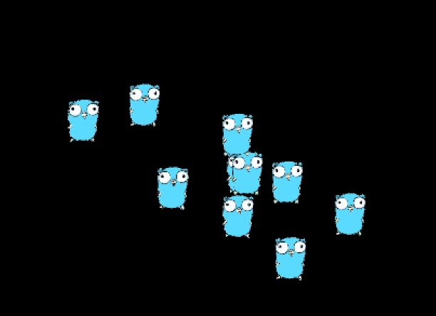

a little demo in [go](https://go.dev) using the [ebiten](https://ebiten.org/) game engine

vaguely follows my memory of how flocking algorithms work. Every so often each
gopher picks a new target point and accelerates towards that. New target points
are randomly distributed around a central point. To prevent the flock heading
offscreen the central point is a weighted blend between the centre of the
screen and the centre of gravity of the flock, with the weight set by how far
the flock is from the centre of the screen. A simple proportional,
differential, integral control algorithm is used to set the acceleration. The
current weights are underdamped so the gophers bounce back and forth a little
(ringing) before reaching the target. 

